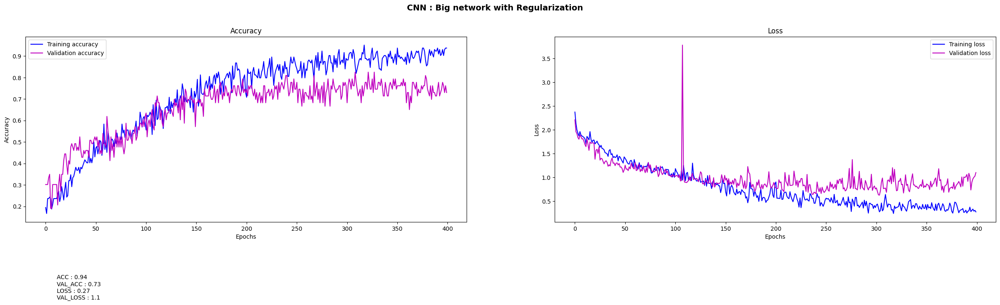
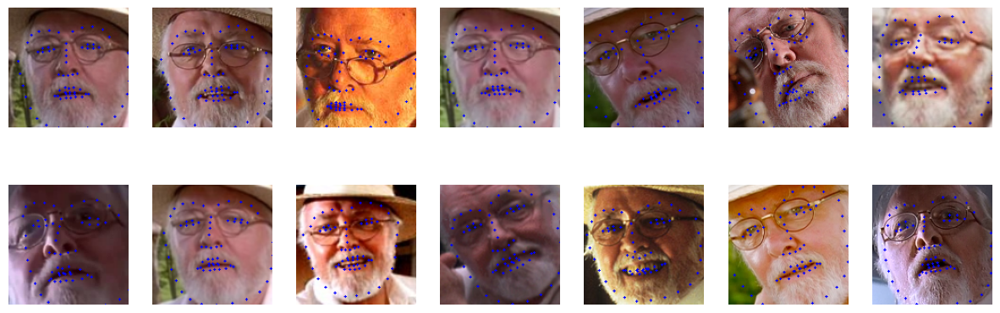

# EL_3003-IA_et_Deep_Learning : 

[](https://github.com/pauline-gllrt)
[](https://github.com/Aubert-Antoine/EL_3003-IA_et_Deep_Learning/tree/main/Project%20FaceRecognition)
[](https://colab.research.google.com/github/Aubert-Antoine/EL_3003-IA_et_Deep_Learning/blob/main/Project%20FaceRecognition/TP7_FaceRecognition.ipynb)

## Project Face Recognition : 

The goal of lab7 is to perform face recognition on a small database using a convolutional neural network (CNN) and compare its performance with other classifiers such as KNN, SVM or logistic regression. Three approaches are used for face recognition.  

The first approach involves directly using the TensorFlow API Keras to build a CNN. In this method, raw images are used as input data, which is not highly efficient because the data is not normalized. Therefore, in the second step, data normalization is performed to improve the efficiency of the model. Finally, face encoding is performed using vectors, allowing us to use a dense network directly. This approach is used for many reasons, including the ability to compare results with other classification methods that use vectors. 

### Section of the Notebook :
1. Load the dataset of images
2. transform images to tensors
3. extract faces within images ( OpenCV and Dlib)
4. Proceed to face recognition using Neural networks (Keras)
   1. Face detection 
   2. Pose estimation
   3. Face encoding
   4. Face recognition
5. Compare results between ConvNet and other kind of classifieurs
6. **Build our own database and repeat the process**

**Data Base structure :**
````bash
custom_dataset
├── firstname_lastname
│   ├── File firstname_lastname0.jpeg
│   └── File firstname_lastname1.jpeg
├── firstname_lastname
│   ├── File firstname_lastname0.jpeg
│   └── File firstname_lastname1.jpeg
├── ...
│   ├── File firstname_lastname0.jpeg
│   └── File firstname_lastname1.jpeg
````

### Results : 
>**Note** : 
**It is an ongoing project !**

**With our convolutional networks**

*Our first ConvNet on 400 epoch, it overfits a lot !*


*Example of point detected by Dlib*

**Result with scikit-learn classifiers**
````text
classifier_KNN : (7)
Execution time : 3.969 ms
Score  	       : 98.61 %
-----------------------------------

classifier_KNN : (3)
Execution time : 0.941 ms
Score  	       : 98.61 %
-----------------------------------

classifier_SVM : ('linear')
Execution time : 0.077 ms
Score  	       : 100.00 %
-----------------------------------

classifier_SVM : ('rbf')
Execution time : 0.134 ms
Score  	       : 100.00 %
-----------------------------------

classifier_LR : 
Execution time : 0.028 ms
Score  	       : 100.00 %
-----------------------------------
````
---
### Face Recognition details

##### 1. Face detection :
The first step in your pipeline is face detection. Normalize the cropped faces (i.e., divide the pixel values by 255), and split them in train set (70%) and test set (30%) with the function train_test_split in the package sklearn.Train a small convnet and check its performance on the test set. Then try to improve the performance of the baseline convnet by using all the tricks you have learned in the course.

##### 2. Pose estimation :
You have isolated the faces in our image. But now you have to deal with the problem that faces turned different directions look totally different to a computer. To account for this, you will try to warp each picture so that the eyes and lips are always in the same place in the image. More concretely, you are going to use an algorithm called face landmark estimation. The basic idea is to locate 68 specific points (called landmarks) that exist on every face:  the top of the chin, the outside edge of each eye, the inner edge of each eyebrow, etc. Then, you’ll simply rotate, scale and shear the image so that the eyes and mouth are centered as best as possible. This will make face recognition more accurate.

##### 3. Face encoding :
The training process works by looking at 3 face images at a time: the picture of a known person, another picture of the same known person, and a picture of a totally different person. Then, the algorithm looks at the measurements currently generated for each of those three images. It tweaks the neural network slightly to make sure that the measurements generated for the same person are slightly closer, and the measurements for different persons are slightly further apart. After repeating this step millions of times for millions of images of thousands of different people, the convnet learns to generate 128 measurements for each person.

##### 4. Face recognition :
This last step is actually the easiest one in the whole process. All you have to do is find the person in your database of known people who has the closest measurements to some test image. You can do that by using any machine learning classification algorithm, such as neaural network (as you did in the previous section), logistic regression, SVM, nearest neighbours, etc. All you need to do is training a classifier that can take in the measurements from a new test image, and tells which known person is the closest match. Running this classifier must only take milliseconds, so that you can apply it to video sequences.

---